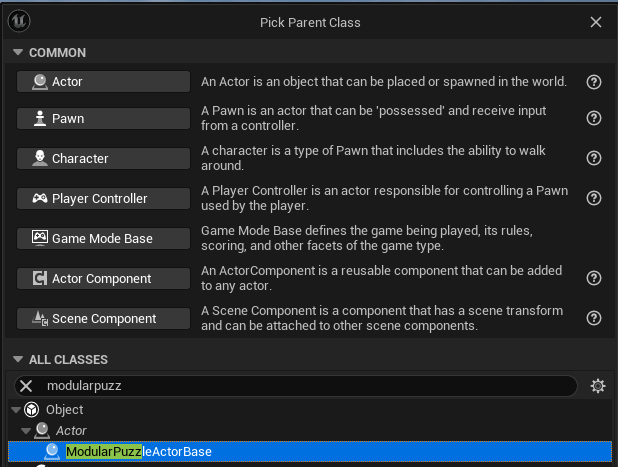
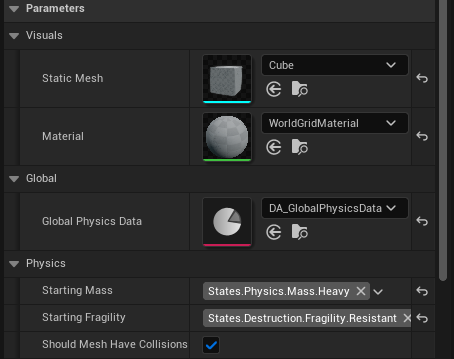
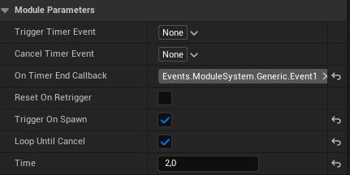
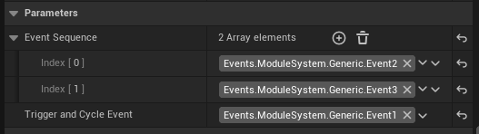
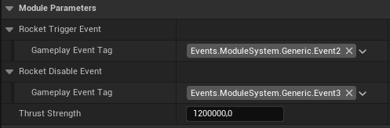

Créer un modular actor basique
===============================

| Sur cette page on va créer un modular actor basique.

| Ce modular actor sera une fusée qui s'envole et retombe toutes les 2 secondes.

| On va utiliser les modules suivants: 
| **Timer Module** : Module qui représente un timer d'une certaine durée, est activé par un event ou au spawn de l'acteur en fonction de ses paramêtres, et active un event à la fin de son timer.
| **Callback Sequence** : Module qui contient une liste de callbacks, et un "curseur" qui démarre sur le 1er callback de la liste. A chaque activation via event, le callback sur lequel le curseur est est activé puis le curseur passe sur le callback suivant. A la fin de la liste il retourne au 1er. Précédemment appelé Event Sequence.
| **Rocket Module** : Module qui représente une fusée. Quand il est activé, il applique une force a l'acteur dans la direction opposé de son axe X, et s'arrête quand désactivé.

| L'acteur sera donc constitué d'un Timer Module configuré pour se répéter en boucle, un Event Sequence déclenché par le Timer et contenant 2 events, et un Rocket Module activé et désactivé par les 2 events de l'Event Sequence.

1. Créez un nouveau blueprint de type ModularPuzzleActorBase

2. Allez à la catégorie Parameters (ne changez pas de propriétés pas hors de cette catégorie) et configurez les options de base de l'acteur. On choisis une **mesh** et un **material**, le **GlobalPhysicsData** qui contient toutes les données dont les global systèmes ont besoin (les différents tiers de masses, sizes, etc), la **masse** de l'objet, sa **fragilité** (actuellement inutilisé), et si il devrais avoir des collisions ou non.

1. Ajoutez un component TimerModule et configurez ses paramêtres. On configure le timer pour qu'il **démarre tout seul** et se **répète** en boucle. On ne met **pas d'events de trigger ou cancel** car la fusée ne doit jamais arrêter son comportement. On met un configure le **callback de fin de timer**.

1. Ajoutez un component CallbackSequence et configurez ses paramêtres. On connecte TriggerAndCycleEvent au callback du timer. On met 2 callbacks dans la liste de callbacks, un pour activer le RocketModule et un pour le désactiver.

1. Ajoutez un component Rocket Module et configurez ses paramêtres. On connecte RocketTriggerEvent au 1er callback de CallbackSequence, et RocketDisableEvent au 2e. On met une force qui doit être assez forte pour pousser l'objet en fonction de la masse choisie plus tôt.

6. Rotatez le RocketModule pour que son axe X soit pointé vers le bas (une rotation à -90 sur l'axe Y devrait suffire)
7. Mettez le blueprint dans un Level et Lancez le jeu. Normalement l'acteur devrait alterne entre lentement accélerer vers le haut et retomber toutes les 2 secondes.